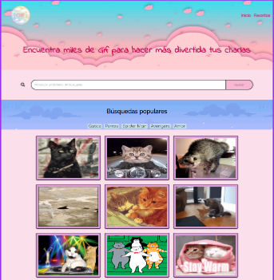

### Este portfolio fue desarrollado en mi cursada de Ada. Agradezco a [Malena Rey] y mis compañeras de cursada por su acompañamiento en este camino y su ayuda codeadora 

### Ingresando al link [https://silly-saha-ca575b.netlify.app/] podrán acceder a una página de búsqueda de Gif. La misma esta realizada con JavaScript, Sass y API. 

### si quieres tener el código en tu computadora "Siganme los buenos". Mira estos sencillos pasos.
- Ir al [repositorio](https://github.com/gri-espindola/proyecto-ada) - Darle click al botón de *folkear*
- Darle click al botón de <-code->
- Copiar la **url**.
- Abrir tu terminal y poner el comando de **git clone <url>**
- Entrar a la carpeta del proyecto y abrirlo en tu *IDE* 
### Este proyecto no necesita la instalación de ninguna dependencia, por ahora.

### Y... ¡No han contado con mi astusia!

Este debería ser el resultado final de tu instalación. 

#### De *Gri* con ❤ Para todo el 🌍 